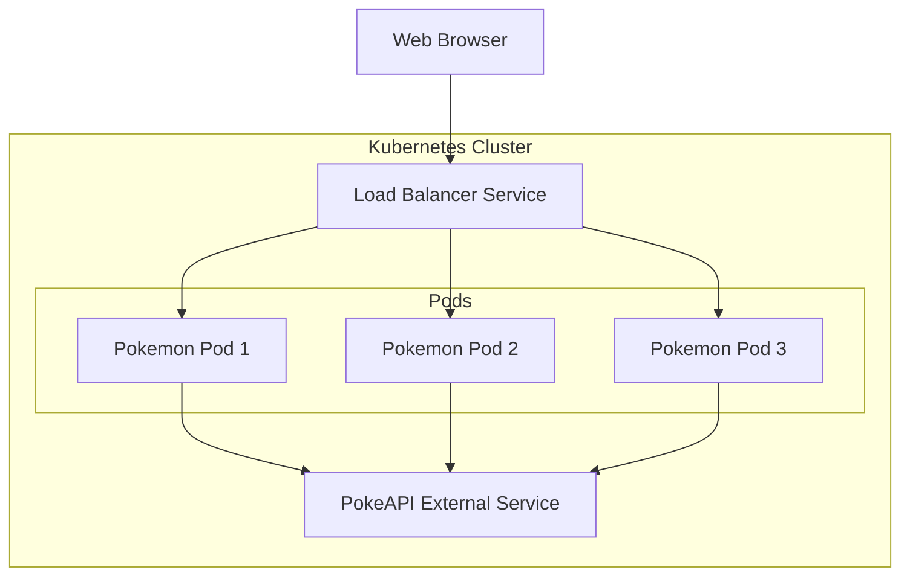
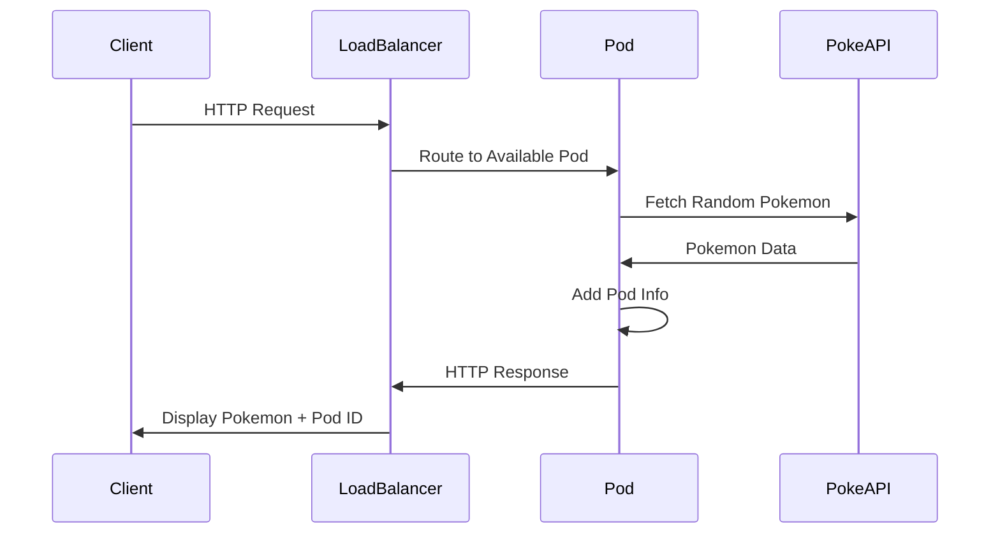

# Pokemon Checker - Kubernetes Learning Project

A simple Kubernetes learning project that displays random Pokemon information using a Go web application. This project demonstrates core Kubernetes concepts through a fun, interactive application.

## Project Overview

This project creates a load-balanced web application that:

- Fetches and displays random Pokemon data
- Shows which pod is serving each request
- Demonstrates Kubernetes load balancing in action
- Provides hands-on experience with basic Kubernetes operations

## Architecture



### Component Flow



## Prerequisites

- Docker installed
- Kubernetes cluster (Minikube, Docker Desktop, or cloud provider)
- kubectl configured
- Go 1.19 or higher
- Docker Hub account

## Quick Start

1. Clone the repository:
```bash
git clone [repository-url]
cd pokemon-checker
```

2. Deploy the application:
```bash
# Make the deployment script executable
chmod +x deploy.sh

# Deploy with your Docker Hub username
./deploy.sh YOUR_DOCKERHUB_USERNAME
```

3. Watch the pods in action:
```bash
# Get your service URL
kubectl get service pokemon-service

# Watch pod load balancing
while true; do curl -s http://$SERVICE_IP | grep "Pod"; sleep 1; done
```

## Learning Objectives

This project helps you learn:

### Basic Kubernetes Concepts:
- Pods: Smallest deployable units in Kubernetes
- Deployments: Manages the lifecycle of pods
- Services: Exposes pods to network traffic
- Load Balancing: Distributes traffic across pods
- Self-healing: Automatic recovery from failures

### Common kubectl Commands:
- `kubectl get pods`: List all pods
- `kubectl describe pod`: Show detailed pod information
- `kubectl logs`: View container logs
- `kubectl exec`: Run commands in containers
- `kubectl apply`: Apply configuration files

### Container Management:
- Building Docker images
- Pushing to registries
- Container shells and execution
- Log management and debugging

## Project Structure

```
.
├── main.go                 # Go web application
├── Dockerfile             # Container definition
├── deploy.sh             # Deployment script
├── kubernetes/           # Kubernetes configurations
│   ├── deployment.yaml   # Pod deployment configuration
│   └── service.yaml      # Service configuration
├── templates/            # HTML templates
│   └── index.html        # Main page template
└── static/              # Static assets
    └── style.css        # Styles for web interface
```

## Important Files Explained

### main.go
- Main Go web application
- Fetches random Pokemon from PokeAPI
- Displays Pokemon information and pod details
- Uses HTML templates for rendering

### deployment.yaml
```yaml
apiVersion: apps/v1
kind: Deployment
metadata:
  name: pokemon-checker
spec:
  replicas: 2
  selector:
    matchLabels:
      app: pokemon-checker
  template:
    metadata:
      labels:
        app: pokemon-checker
    spec:
      containers:
      - name: pokemon-checker
        image: YOUR_DOCKERHUB_USERNAME/pokemon-checker:latest
        ports:
        - containerPort: 8080
```

### service.yaml
```yaml
apiVersion: v1
kind: Service
metadata:
  name: pokemon-service
spec:
  selector:
    app: pokemon-checker
  ports:
    - port: 80
      targetPort: 8080
  type: LoadBalancer
```

## Common Operations

### Scale the Deployment
```bash
# Increase replicas
kubectl scale deployment pokemon-checker --replicas=5

# Verify scaling
kubectl get pods
```

### View Pod Logs
```bash
# Follow logs from all pods
kubectl logs -f -l app=pokemon-checker

# View logs from specific pod
kubectl logs -f pokemon-checker-xyz
```

### Access Container Shell
```bash
# Get shell access
kubectl exec -it pokemon-checker-xyz -- sh

# Verify application files
ls /app
```

### Check Pod Status
```bash
# Detailed pod information
kubectl get pods -o wide

# Watch pod changes
kubectl get pods -w
```

### Delete and Recreate
```bash
# Delete a pod (it will be recreated)
kubectl delete pod pokemon-checker-xyz

# Delete whole deployment
kubectl delete deployment pokemon-checker
```

## Troubleshooting

If pods aren't starting:

1. Check pod status:
```bash
kubectl describe pod pokemon-checker-xyz
```

2. View logs:
```bash
kubectl logs pokemon-checker-xyz
```

3. Verify service:
```bash
kubectl get service pokemon-service
```

Common issues:
- ImagePullBackoff: Check Docker Hub credentials and image name
- CrashLoopBackOff: Check application logs for errors
- Pending: Check cluster resources and node status

## Learning Exercises

### Scale Exercise:
```bash
# Scale to 5 pods
kubectl scale deployment pokemon-checker --replicas=5

# Watch the pods being created
kubectl get pods -w

# Check load balancing
while true; do curl -s http://$SERVICE_IP | grep "Pod"; sleep 1; done
```

### Self-healing Exercise:
```bash
# Delete a pod and watch it recreate
kubectl delete pod pokemon-checker-xyz
kubectl get pods -w
```

### Rolling Update Exercise:
```bash
# Update the image and watch rolling update
kubectl set image deployment/pokemon-checker pokemon-checker=new-image:tag
kubectl rollout status deployment/pokemon-checker
```

## License

MIT License - See LICENSE file for details.

## Acknowledgments

- PokeAPI for providing Pokemon data
- Kubernetes community for excellent documentation
- Go community for the programming language and tools
